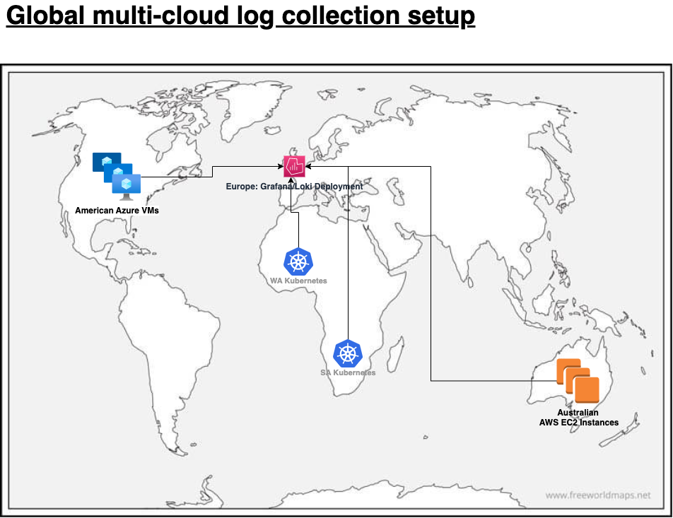

# Create a simple global multi-cloud log collection setup
This example shows you how to easily setup a multi-cloud log collection setup.

## Architecture


## Infrastructure Provisioning

__Provision Grafana and Loki.__
1. Provision a grafana using Ametnes Cloud
    > Save access credentials.
2. Provision a loki instance using Ametnes Cloud and save access credentials.
    > Save access credentials.

__Provision bare metal infrastructure.__

We provision cloud infrastructure using terraform.

1. Checkout the grafana repository
2. Initialise and provision Azure VMs
    ```
    cd src/az
    terraform apply
    ```
    > Set the `loki_endpoint` such as `https://<user>:<password>@resource-6902388007-loki.prod-accounts.ametnes.net/loki/api/v1/push`
3. Initialise and provision AWS EC2 instances
    ```
    cd src/aws
    terraform apply
    ```
    > Set the `loki_endpoint` such as `https://<user>:<password>@resource-6902388007-loki.prod-accounts.ametnes.net/loki/api/v1/push`

__Provision edge kubernetes clusters.__

For this, we will use local `kind` clusters

1. Setup South Africa Infrastructure
    - Provision the kubernetes cluster in South Africa
    ```
    kind create cluster --config src/k8s/k8s-sa.yml --name k8s-sa
    ```
    - Create a `values.secrets.yml` file with the contents
    ```yaml
    config:
        clients:
            - url: https://<user>:<password>@resource-6902388007-loki.prod-accounts.ametnes.net/loki/api/v1/push
    ```
    - Install promtail service
    ```
    helm repo update 
    helm repo add grafana https://grafana.github.io/helm-chart
    helm upgrade --install promtail grafana/promtail --version 6.9.3 -f values.secrets.yml -n kube-system
    ```

2. Setup West Africa Infrastructure
    - Provision the kubernetes cluster in South Africa
    ```
    kind create cluster --config src/k8s/k8s-wa.yml --name k8s-wa
    ```
    - Create a `values.secrets.yml` file with the contents
    ```yaml
    config:
        clients:
            - url: https://<user>:<password>@resource-6902388007-loki.prod-accounts.ametnes.net/loki/api/v1/push
    ```
    - Install promtail service
    ```
    helm upgrade --install promtail grafana/promtail --version 6.9.3 -f values.secrets.yml -n kube-system
    ```

## View Logs in Grafana
1. Add loki as a datasource in Grafana
2. Explore loki logs
3. Create a dashboard
